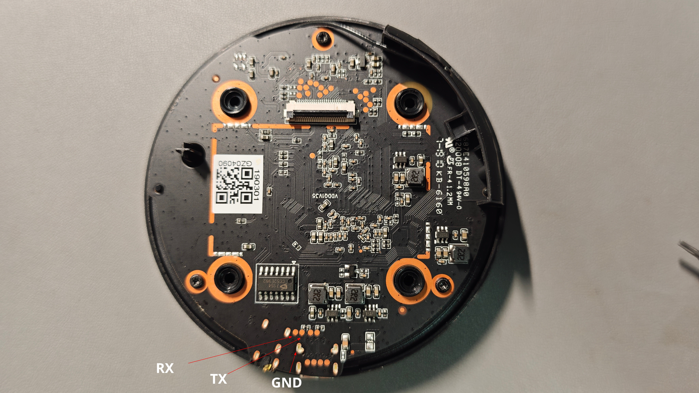

# Rokid Mini 若琪 繁星 RP105

An entry-level desktop smart speaker launched by Rokid, featuring a 4-microphone array and a 12 RGB LED light ring.

## Officail Documents

~~https://developer.rokid.com/docs/rokidos-linux-docs/reference/dev_board/amlogic/usermanual_a113.html#amlogica113~~

https://github.com/rokid/docs/blob/master/rokidos-linux-docs/reference/dev_board/amlogic/usermanual_a113.md

The schematic diagram is currently unavailable.

## Hardware
| Specifications            | Description                                                  |
| ------------------------- | ------------------------------------------------------------ |
| Size                      | 92×92×37mm                                                   |
| PCB revision              | RM-MPEG-214G VER1.0 2017                                     |
| Model                     | RP105                                                        |
| SoC                       | Amlogic [A113X](https://www.amlogic.cn/product/stencil.html#Products/232/index.html)/Quad-Core ARM Cortex-A53@1.5GHz |
| DRAM                      | 2Gb DDR3 SDRAM Nanya [NT5CB128M16IP-EK](https://item.szlcsc.com/3042430.html)/933MHz |
| NAND Flash                | 4Gb NAND Flash Samsung [K9F4G08U0F-SCB0](https://flashinfo.top/FlashInfo?pn=K9F4G08U0F) |
| Ethernet PHY Transceiver  | 802.11b/g/n BT4.0 AMPAK [AP6212](https://fccid.io/PJ5-AX905/User-Manual/User-manual-3321089.pdf)/C11310661 1905/1T1R |
| Stereo DAC                | Everest-semi [ES7154](https://www.pawpaw.cn/media/documents/2021-12/ES7154_DS.pdf) |
| Audio Power Amp           | Powtech [PT5305N](https://www.sunnyqi.com/blog/post/687.html)/3W/Class D |
| Cap Touch + LED Driver IC | Microchip [CAP1114](https://ww1.microchip.com/downloads/en/DeviceDoc/1114db.pdf) |

| Interface     | Description                                               |
| ------------- | --------------------------------------------------------- |
| USB Type-C    | *1, USB 2.0, power supply and ADB debug (vendor firmware) |
| 3.5mm AUX Out | *1                                                        |

## Amlogic A113X

https://linux-meson.com/hardware.html

>- AXG : Audio/IOT dedicated SoC derived from GX family with enhanced audio and MIPI DSI display support and 2xPCIe 2.0 x1 lanes
>  - A113D
>  - A113X: similar to A113D, without PCIe and MIPI DSI Output

## Debug UART

The debug serial port is located at the test point near the Type-C port on the CPU Board.

Level: 3.3V

## Mainline Linux

The mainline Linux currently supports the AXG series, the S400 development board, and the jethome-jethub.

## Blogs and Forums

[什么值得买 - 小瞄鹿@ROKID Mini RP105 若琪梵星智能音箱使用体验](https://post.smzdm.com/p/aek8kkx4/)

[CSDN - Leekwen@若琪智能音响Rokid硬件拆解及系统架构分析](https://blog.csdn.net/leekwen/article/details/79765854)

[Bilibili - 老刘玩机@Rokid Mini 若琪梵星 移动定制智能音箱拆解](https://www.bilibili.com/video/av797327309/)

[HardYun - laoliu@#53 Rokid Mini 若琪梵星 移动定制智能音箱拆解](http://www.hardyun.com/376.html)

[CNX-Software - JetHome JetHub D1 is a Linux automation controller based on Amlogic A113X SoC](https://www.cnx-software.com/2022/02/01/jethome-jethub-d1-linux-automation-controller-based-on-amlogic-a113x-soc/)

[CNX-Software - Amlogic A111, A112 & A113 Processors are Designed for Audio Applications, Smart Speakers](https://www.cnx-software.com/2017/09/09/amlogic-a111-a112-a113-processors-are-designed-for-audio-applications-smart-speakers/)

[CNX-Software - Amlogic A113X1 6-Mic Far-Field Devkit is Designed for Amazon Alexa](https://www.cnx-software.com/2018/01/11/amlogic-a113x1-6-mic-far-field-devkit-is-designed-for-amazon-alexa/)
