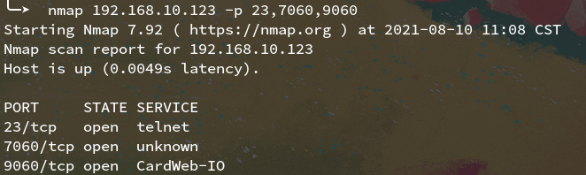

# Protruly SC150MBN1 WiFi image transmission

##  Description/Taobao link

[2.4G WIFI无线图传 汽车夜视系统图传 以前卖过](https://item.taobao.com/item.htm?id=648102298565)

>汽车夜视系统图传，wifi的，以前卖过，记得已经研究出资料，研究价，模拟信号输入。

[视频传送无线wifi图传 发射机 汽车行车记录仪无线图传配件](https://item.taobao.com/item.htm?id=647159379787)

>频无线wifi视频图传发射机，原配估计是 保千里夜视辅助系统 的配件，无资料研究品，这款之前也卖过，接口信息以前都有人研究过，店主手里没有资料了，研究品芯片价格出售，无技术支持不支持任性7天退换中差评。单个重约56克。

[保千里行车记录仪夜视主动安全6倍光学变焦破雾通用WIFI隐藏 WiFi版SC150MBN1+遥控器 标配单镜头](https://item.jd.com/10024316770587.html)

[保千里行车记录仪夜视主动安全系统6倍光学变焦破雾通用WIFI隐藏](https://item.taobao.com/item.htm?id=629350368092)

[保千里夜视主动安全系统6倍光学变焦破雾通用WIFI隐藏行车记录仪](https://item.taobao.com/item.htm?id=630344135593)

## Hardware

| Specification            | Description                                                  |
| ------------------------ | ------------------------------------------------------------ |
| S/N                      | E8ABFF5144E4                                                 |
| PCB Revision             | LW-8309 REV: 3.2 2015/07/30                                  |
| SoC                      | Ralink [RT5350F](https://deviwiki.com/wiki/Ralink_RT5350) /TP46X25609 154PTA1/ |
| SDRAM                    | ESMT [M12L2461616A](https://www.esmt.com.tw/upload/pdf/ESMT/datasheets/M12L2561616A(2S)_operation%20temperature%20condition%20-40~85%C2%B0C.pdf) /- 6T AZA1P54T6 1546/32MB |
| Camera Controller        | Arkmicro [ARK3399](https://www.kynix.com/Detail/111730/ARK3399.html) /V399 G151537147 |
| Video Display Controller | Arkmicro [AMT630](https://datasheetspdf.com/pdf/840049/ARKMICRO/AMT630/1) /G150101236N/ |
| Serial Flash             | Macronix [MX25L4006E](https://www.mxic.com.tw/en-us/products/NOR-Flash/Serial-NOR-Flash/Pages/spec.aspx?p=MX25L4006E&m=Serial%20NOR%20Flash&n=PM1576) /M1I-126/4Mb |
| Serial NOR Flash         | Winbind [W25Q32FV](https://www.winbond.com/hq/product/code-storage-flash-memory/serial-nor-flash/?__locale=en&partNo=W25Q32FV) /25Q32FVSIG 1530/32Mb |
| EEPROM                   | HHGrace [K24C32](https://item.szlcsc.com/184570.html) /1430TDX/32Kb |

- all Pictures of the ICs is in `/image`.

- all datasheets of the ICs is in `/datasheet`.

## Stock Firmware

### WiFi

- the suffix code  of *SSID* is same as *S/N*.

### UART

- TX of analog input port transmit the above data repeatly sine device boots to startup.

- baudrate: `9600`

### Network Port

### Telnet user and password crack

- metasploit

- hack firmware 

## Analog Input Port

| Pin    | Description        |
| ------ | ------------------ |
| GND    | Ground             |
| DC_VIN | 5V                 |
| RESET  | Reset              |
| TX     | UART baudrate 9600 |
| RX     | UART baudrate 9600 |
| MIC_IN | Audio input        |
| AV_IN  | Video input        |

 

## USB

