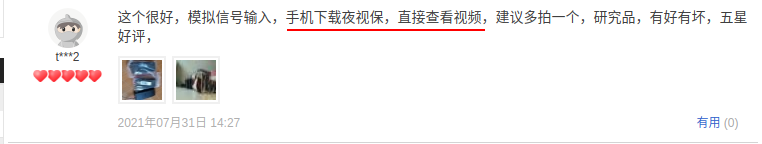
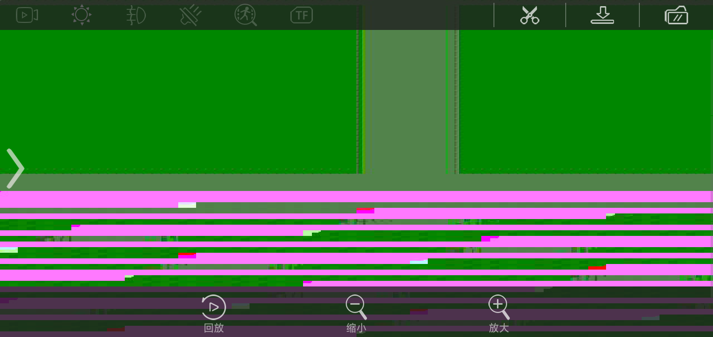
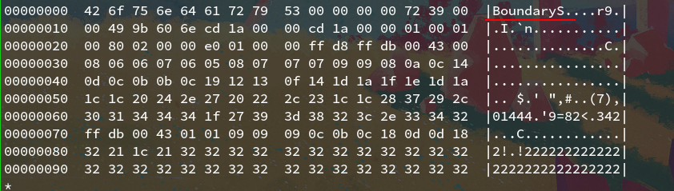
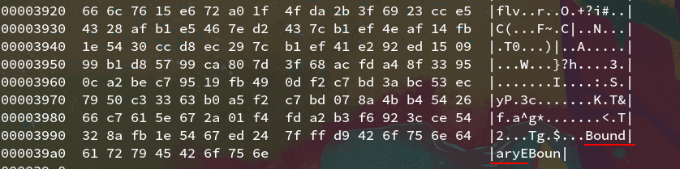
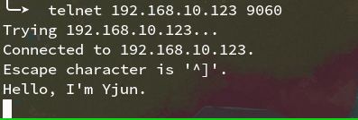

# note

## Telnet user and password crack

### Metasploit

[metasplot for archlinuxarm](https://gitee.com/yjun123/alarm-pkgbuilds/tree/master/metasploit)

- start metasploit 

execute `msfconsole`

- user telnet auxiliary 

type `use auxiliary/scanner/telnet/telnet_login`

- get user/pass dictionary

[TgeaUs/Weak-password[(https://github.com/TgeaUs/Weak-password)

- set option

```
set rhosts 192.168.10.123 # set target host
set user_file 常用 # set username dictionary
set pass_file 常用 # set password dictionary
set stop_on_success true
set THREADS 4 # set thread to crack
```
- start exploit

execute `run/exploit`

### Hack firmware

[dumping-firmware-with-the-ch341a-programmer](https://www.blackhillsinfosec.com/dumping-firmware-with-the-ch341a-programmer/)

- dump firmware with ch341a programmer

  `sudo flashrom -p ch341a_spi --read SC150MBN1-firmware-dump.bin`

- extract the file from firmware with binwalk

  `binwalk -eM SC150MBN1-firmware-dump.bin`

- get user name and password

  ```bash
  # _SC150MBN1-firmware-dump.bin.extracted/_50040.extracted/_33F000.extracted/cpio-root/sbin/start.sh
  #!/bin/sh
  #
  # mark 13922845352
  #
  # usage: start.sh
  #
  
  ###########################################################
  login="lewei"
  pass="leweilewei"
  ipaddr="192.168.10.123"
  start="192.168.10.20"
  end="192.168.10.50"
  wname=`flash -a`
  wpassword=`flash -p`
  haspassword=`flash -h`
  ###########################################################
  ```

  

## Other open ports

- 7060

  - comminication port to App

  
  
  
  
  
  
  
  
  - protocol
  
  
  
  ​								

<center>BoundaryS(tart)</center>



<center>BoundaryE(nd)</center>

​									tips: binary data `port-7060-data.bin` is in `/bin`

- 9060

  ​	wireless to UART port

  

<center>telnet 9060</center>


<center>minicom UART</center>

​							
