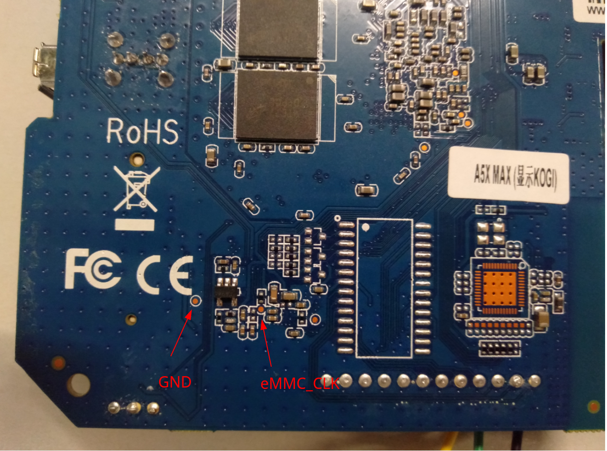
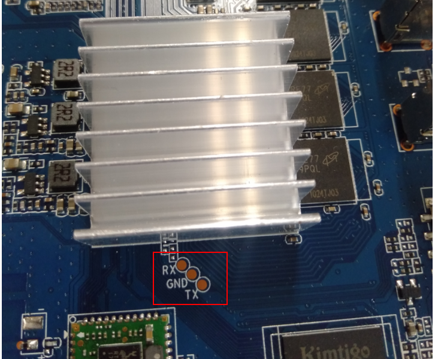

# A5X Max RK3328 TV Box


## Hardware

| Specification    | Description                                                  |
| ---------------- | ------------------------------------------------------------ |
| PCB revision     | MXQ-RK3328-D4_A VER:2.0 DATE:20181219 DESIGN FROM HUGSUN     |
| SoC              | Rockchip [RK3328](https://www.rock-chips.com/a/en/products/RK33_Series/2017/0118/829.html)@1.5Ghz/Quad-core Cortex-A53 |
| DRAM             | 512MiB * 8 (4GiB) DDR3 Micron [MT41K1G4RH-125:E](http://www.microndram.com/MT41K1G4RH-125_E.html)/D9PQL/PBGA78 |
| eMMC             | 32GiB eMMC Kimtigo [KM110SS1032GxA-DDD00WT](http://www.kimtigo.net/product.php?seq=54&locale=cn)/eMMC 5.1/FBGA153 |
| Wireless Module  | 2.4G 802.11 bgn/BT 4.0 Realtek [RTL8723BS](https://www.realtek.com/en/products/communications-network-ics/item/rtl8723bs) |
| USB Hub IC       | USB 2.0 Hub Controller [GL850G](http://www.genesyslogic.com/en/product_view.php?show=21)/SSOP28 |
| PMU/PMIC         | No                                                           |
| Lan Transformer  | 100BASE-TX Pulse [H1102NL](https://productfinder.pulseeng.com/product/H1102NL) |
| Power            | DC 5V@2.5A                                                   |
| Size (L x W x H) | 115 x 115 x 25 mm                                            |

- all datasheets see `datasheet` directory

| Interface | Description             |
| --------- | ----------------------- |
| USB 3.0   | Host * 1                |
| USB 2.0   | Host * 2, OTG * 1       |
| HDMI      | 2.0a * 1                |
| Ethernet  | 10/100M RJ45 * 1        |
| WiFi      | 802.11.b/g/n 2.4Ghz * 1 |
| Bluetooth | BT 4.0 * 1              |
| SD/MMC    | * 1                     |
| Infrared  | * 1                     |
| SPDIF     | * 1                     |
| AV        | * 1                     |


## Rockchip RK3328

| Specification | Description                      |
| ------------- | -------------------------------- |
| CPU           | ARM Cortex-A53 Quad-Core @1.5Ghz |
| GPU           | Mali-450MP4                      |
| Memory        | DDR3/DDR3L/LPDDR3/DDR4 4GB(max)  |

[Rockchip RK3328 Product-Page](https://www.rock-chips.com/a/en/products/RK33_Series/2017/0118/829.html)

[Rockchip RK3328 Wiki](http://opensource.rock-chips.com/wiki_RK3328)

[Rockchip RK3328 Datasheet](http://opensource.rock-chips.com/images/9/95/Rockchip_RK3328_Datasheet_V1.3-20200310.pdf)

[Rockchip RK3328 TRM](http://opensource.rock-chips.com/images/8/8f/Rockchip_RK3288_TRM_V1.2_Part1-20170321.pdf)

[Rockchip RK3328 Hadrware Reference (Schematic & Layout Guide)](http://opensource.rock-chips.com/images/9/97/Rockchip_RK3328TRM_V1.1-Part1-20170321.pdf)


## Flash

### eMMC short circuit



### Linux Flash Tool

[rkdeveloptool](https://aur.archlinux.org/packages/rkdeveloptool-git/)

### Steps

- detect maskrom mode device

  ```
  $ rkdeveloptool ld                   
  DevNo=1 Vid=0x2207,Pid=0x320c,LocationID=101    Maskrom
  ```

- flash the image into eMMC

  ```
  rkdeveloptool db rk3328_loader.bin #rk3328_loader_v1.14.249.bin
  rkdeveloptool wl 0x0 ArchLinuxARM-aarch64-beikeyun-2019-09-16.img
  rkdeveloptool rd
  
  $ rkdeveloptool db rk3328_loader.bin
  Downloading bootloader succeeded.
  $ rkdeveloptool wl 0x0 ArchLinuxARM-aarch64-beikeyun-2019-09-16.img
  Write LBA from file (100%)
  ```

- dump vendor firmware

  ```
  # 32 * 1000 * 1000 * 1000 / 512 = 62500000
  $ rkdeveloptool rl 0x0 62500000 a5x-max-vendor-firmware-dump.img
  ```

  

## TTL UART



**baudrate**: `1500000`


## Wireless


### Linux Staging Driver

[rtl8723bs](https://github.com/torvalds/linux/tree/master/drivers/staging/rtl8723bs)

## Device Tree


## Mainline Linux


## Mainline U-Boot


## Website

[geekbuying.com - A5X MAX Android 9.0 4GB/32GB RK3328 4K TV BOX WIFI LAN KODI 18.0 HDR VP9 USB3.0](https://www.geekbuying.com/item/A5X-MAX-RK3328-4GB-32GB-TV-Box-388745.html)

[ech.scargill.net - The A5X MAX Android 8.1 TV Box](https://tech.scargill.net/the-a5x-tv-android-box/)

[thephonetalks - A5X MAX TV Box – The First Chinese TV Box To Feature Android 9.0](https://www.thephonetalks.com/a5x-max-tv-box-features-price/)

[forum.armbian.com - A5X MAX RK3328 4GB/16GB](https://forum.armbian.com/topic/4895-a5x-max-rk3328-4gb16gb/)

> 44GB RAM * 16G eMMC
>
> MXQ-RK3328-D4_A
>
> VER: 1.0 DATA: 20170713

[forum.armbian.com - A5x max - rk3328 help booting from emmc](https://forum.armbian.com/topic/11294-a5x-max-rk3328-help-booting-from-emmc/)

[forum.armbian.com - Armbian for TV box rk3328](https://forum.armbian.com/topic/8082-armbian-for-tv-box-rk3328/)

[forum.armbian.com - Help with A5X Max](https://forum.armbian.com/topic/9192-help-with-a5x-max/)

[cloudynights.com - Android TV Box as mount side computer](https://www.cloudynights.com/topic/645034-android-tv-box-as-mount-side-computer/)

