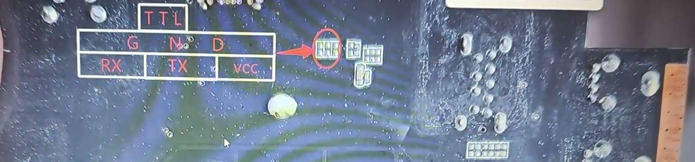

# FMX1 PRO-V10(XT_X1 PRO_V10)

## Hardware

| Specifications        | Description                                                  |
| ----- | --- |
| PCB revision          | XT_X1 PRO_V10                                                |
| SoC                   | 2 * Cortex-A72 and 4 *Cortex-A53/Mali-T860/Rockchip RK3399   |
| DRAM                  | LPDDR3 16Gb * 2/ Samsung [K4E6E304EB-EGCF](https://semiconductor.samsung.com/dram/ddr/ddr3/k4b8g1646d-myk0/)/FBGA178/2133 Mbps |
| Power                 | DC 12V@1A                                                    |
| eMMC                  | eMMC 5.0 32GB /Samsung [KLMBG4GEND-B031](https://semiconductor.samsung.com/estorage/emmc/emmc-5-0/klmbg4gend-b031/)/HS400 |
| Wireless Module       | 802.11a/b/g/n/ac/BT4.2/AMPAK [AP6356S](https://fccid.io/H8N-AP6356S/User-Manual/H8N-AP6356S-User-Manual-4216733.pdf)/2T2R |
| PMU/PMIC              | Rockchip [RK808-D](https://rockchip.fr/RK808%20datasheet%20V1.4.pdf) |
| USB2 Hub              | Genesys Logic [GL850G](https://d148k72crfmm2d.cloudfront.net/wp-content/uploads/2020/02/GL850G.pdf) |
| USB Type C Controller | Onsemi [FUSB302MPX](https://www.t-firefly.com/download/Firefly-RK3399/docs/Chip%20Specifications/FUSB302_PB_Final.pdf) |
| Ethernet              | Realtek [RTL8211E](https://www.t-firefly.com/download/firefly-rk3288/hardware/RTL8211E(G)-xx-CG_DataSheet_1.3.pdf)/10/100/1000 GIGABIT |
| Transformer           | SwapNet [NS892407](https://www.hedingtech.com.tw/download/1517363492.pdf)/10/100/1000Base-T |
| Size                  | 118mm * 98mm                                                 |

| Interface | Description  |
| ------------ | --- |
| USB 2.0 Host | TYPE A Mount Socket * 2 (connected to USB HUB Chip) |
| USB 3.0 Host | TYPE A Mount Socket * 1 |
| Type C | * 1 (with USB Type C Controller) |
| DC | DC5525@12V |
| HDMI         | * 1 |
| SPDIF | * 1 |
| Ethernet     | 10/100/1000M RJ45 * 1 |
| WiFi         | integraed in AP6356S(BCM4356) * 1 |
| MicroSD      | * 1 |
| Infrared     | * 1 |
| Bluetooth    | integraed in AP6356S(BCM4356) *1 |
| Button | * 2 |

- For photos of electronic components, please see the [images](./images) directory.

## Rockchip RK3399

[RK3399 Wiki](http://opensource.rock-chips.com/wiki_RK3399)

| Specification | Description |
| ------------- | ----------- |
| Process | 28nm |
| CPU | Dual-core Cortex-A72 and Quad-core ARM Cortex-A53 |
| GPU | Mali-T860 MP4 |
| Memory | DDR3/DDR3L/LPDDR3/LPDDR4/ |

## AP6356S

| Function | Interface in use |
| -------- | --------- |
| WiFi     |  SDIO     |
| BT       |  UART     |

## TTL UART

**baudrate**: `1500000`

## Mainline Linux

### Device Tree

### config

### patches

## Firmware

## Mainline U-Boot

## Github

## Forums and Blogs

[bilibili - 78元的顶配fmx1_pro(XT_X1 pro) rk3399 4+32机顶盒机皇主板 刷tvbox教程](https://www.bilibili.com/video/BV1hvyYYAEQF/)
