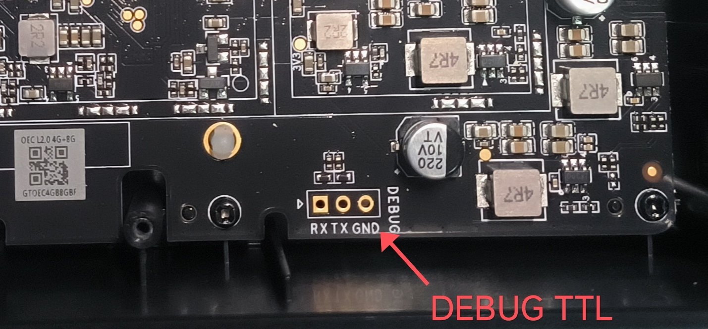
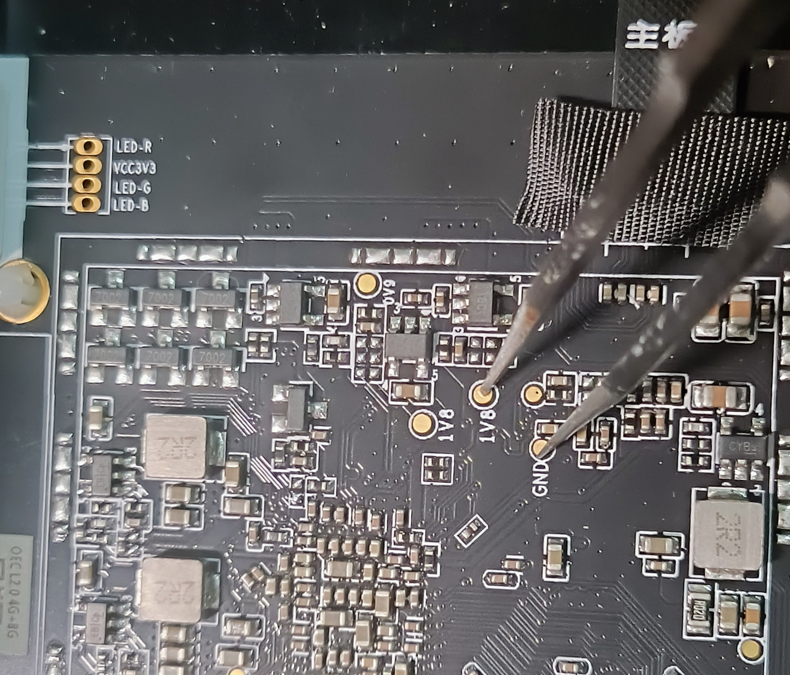
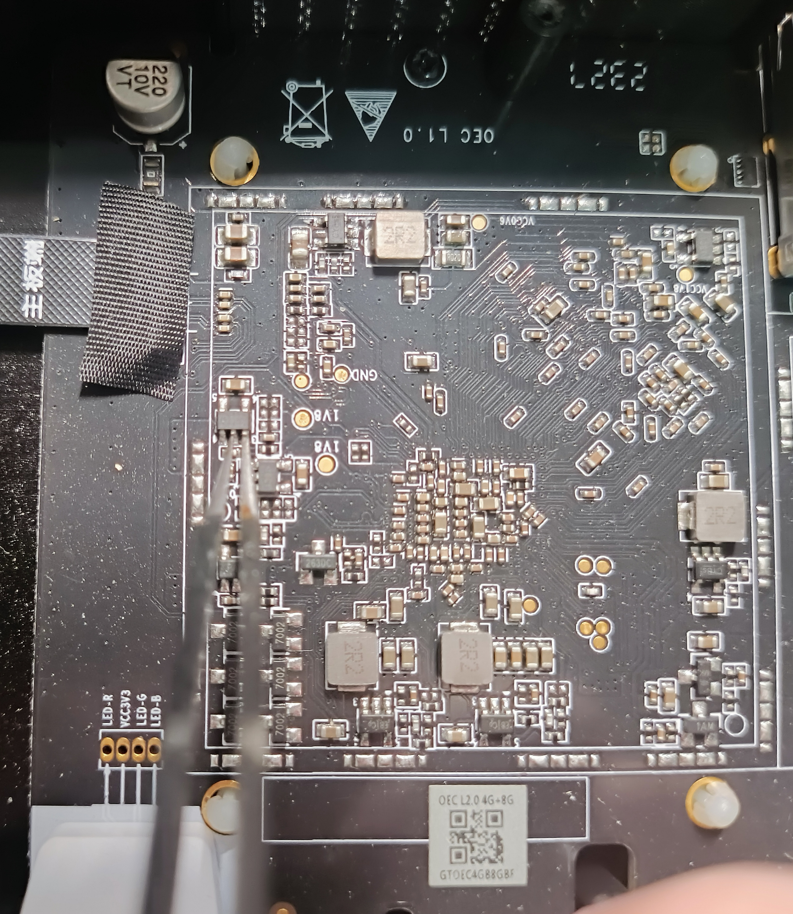

# 网心云 OneThing Cloud OEC Turbo

[OEC Turbo offcial website](https://www.onethingcloud.com/products/oec-turbo/)

 ## Hardware

| Specifications           | Description                                                  |
| ------------------------ | ------------------------------------------------------------ |
| PCB revision             | OEC L1.0                                                     |
| Model                    | EC0520                                                       |
| SoC                      | Rockchip [RK3566](https://www.rock-chips.com/a/en/products/RK35_Series/2021/0113/1274.html)@1.8GHZ/Quad-Core ARM Cortex-A55/Mali-G52 GPU |
| DRAM                     | 32Gb LPDDR4X Samsung [ K4UBE3D4AB-MGCL](https://semiconductor.samsung.cn/dram/lpddr/lpddr4x/k4ube3d4ab-mgcl/)/FBGA200/4266Mbps |
| eMMC                     | 8GB eMMC 5.1 Samsung [KLM8G1GETF-B041](https://semiconductor.samsung.cn/estorage/emmc/emmc-5-1/klm8g1getf-b041/)/HS400 |
| Ethernet PHY Transceiver | 10/100/1000M PHY Realtek [RTL8211F](https://www.realtek.com/Product/Index?id=3975&cate_id=786) |
| Lan Transformer          | 10/100/1000Base-T Siscofer [SG24002-1G](https://www.siscofer.com/lm1/75.html)/SMD 24PIN |
| Size                     | 145mmx90mmx47mm                                              |

| Interface | Description |
| --------- | ----------- |
| Power     | DC 12V/2A *1 |
| USB   | USB 3.0 Type A *1, USB 2.0 Type C *1 |
| Ethernet  | Gigabit Ethernet port *1 |
| SATA      | SATA 3.0 hard drive bay *1 |
| RESET key | *1          |
| RGB LED | *1 |

## Images

see [images](./images)

## Debug TTL



## Maskrom Mode

- Short-circuit 1V8 and GND. (NOT Recommended)



- Short-circuit pins 2 (GND) and 3 (EN) of the LDO (3V3 -> 1V8) with silkscreen "18ct". (**Recommended**)

  For more information, refer to [网心云 OEC/OECT 笔记(1) 拆机刷入Armbian固件 - 关于下载BOOT失败](https://www.cnblogs.com/milton/p/18904928).



## Mainline Linux

The OneThing Edge Cube series (OEC/OEC Turbo) is in the process of being mainlined.

see [[PATCH v4 0/3] board: rockchip: add OneThing Edge Cube series](https://lore.kernel.org/linux-rockchip/20260204132700.329894-1-jerrysteve1101@gmail.com/T/#t)

### Device Tree

[rk3566-onething-edge-cube.dts](./dts/rk3566-onething-edge-cube.dts)

### Local Ethernet Speed Test 

```sh
$ iperf3 -c 192.168.0.113
Connecting to host 192.168.0.113, port 5201
[  5] local 192.168.0.103 port 49906 connected to 192.168.0.113 port 5201
[ ID] Interval           Transfer     Bitrate         Retr  Cwnd
[  5]   0.00-1.00   sec   111 MBytes   932 Mbits/sec    0   2.20 MBytes       
[  5]   1.00-2.00   sec   110 MBytes   925 Mbits/sec    0   2.20 MBytes       
[  5]   2.00-3.00   sec   113 MBytes   948 Mbits/sec    0   2.21 MBytes       
[  5]   3.00-4.00   sec   112 MBytes   936 Mbits/sec    0   2.22 MBytes       
[  5]   4.00-5.00   sec   111 MBytes   929 Mbits/sec    0   2.26 MBytes       
[  5]   5.00-6.00   sec   112 MBytes   942 Mbits/sec    0   2.30 MBytes       
[  5]   6.00-7.00   sec   109 MBytes   912 Mbits/sec    0   2.38 MBytes       
[  5]   7.00-8.00   sec   114 MBytes   957 Mbits/sec    0   2.43 MBytes       
[  5]   8.00-9.00   sec   111 MBytes   934 Mbits/sec    0   2.55 MBytes       
[  5]   9.00-10.00  sec   112 MBytes   938 Mbits/sec    0   2.68 MBytes       
- - - - - - - - - - - - - - - - - - - - - - - - -
[ ID] Interval           Transfer     Bitrate         Retr
[  5]   0.00-10.00  sec  1.09 GBytes   937 Mbits/sec    0            sender
[  5]   0.00-10.00  sec  1.09 GBytes   935 Mbits/sec                  receiver
```


## Reference

[Official - OEC-turbo 产品介绍【新品】](https://help.onethingcloud.com/3b0d/OEC-turbo)

[Firefly - ROC-RK3566-PC](https://wiki.t-firefly.com/zh_CN/ROC-RK3566-PC/index.html)

[OrangerPi - Orange Pi 3B](http://www.orangepi.cn/html/hardWare/computerAndMicrocontrollers/details/Orange-Pi-3B.html)

[Github - OEC-Turbo刷入后变砖 #2814](https://github.com/ophub/amlogic-s9xxx-armbian/issues/2814)

[Github - oec已经有可以直接刷的固件了... #2786](https://github.com/ophub/amlogic-s9xxx-armbian/issues/2786)

[Githb - Add wxy OEC-turbo #2736](https://github.com/ophub/amlogic-s9xxx-armbian/pull/2736)

[Blog - 网心云OEC-turbo新一代矿渣神器，刷入Armbian系统喂饭教程](https://mao.fan/article/327)

[Blog - 网心云oecturbo刷机记录](https://miaoyanginfo.github.io/posts/43673.html)

[Blog - 网心云OEC/OECTubro刷机教程(刷iStoreOS)(刷hinas)](https://www.anuna.cn/nas/45.html)

[Blog - 网心云 OEC/OECT 笔记](https://www.cnblogs.com/milton/p/18904928)
