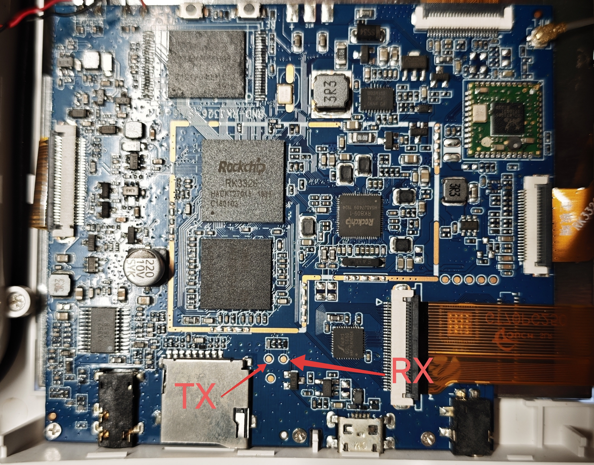
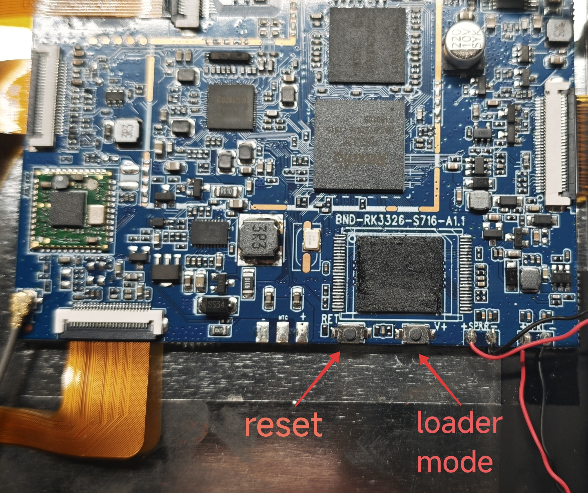
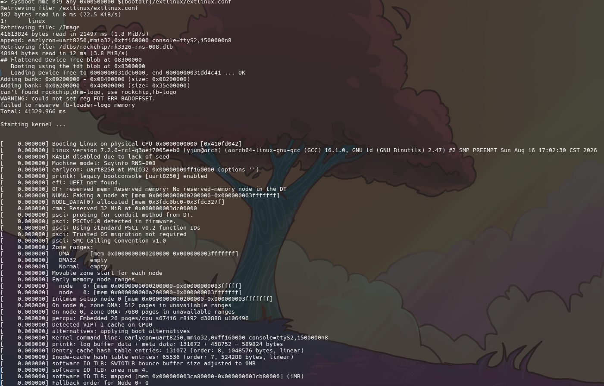
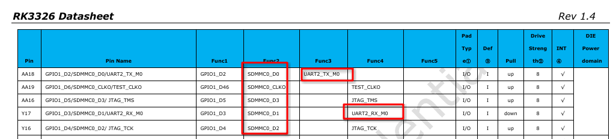

# Sayinfo RNS-008

The RNS-008 is a smart speaker with a display screen manufactured by Hangzhou Sayinfo Intelligent Technology Co., Ltd. (Sayinfo), featuring an interactive screen interface and voice assistant capabilities.

ODM/OEM: [RK3326智能语音音箱](http://www.szbnd.cn/product_xq.php?id=228).

## Hardware

| Specifications          | Description                                                  |
| ----------------------- | ------------------------------------------------------------ |
| Model                   | RNS-008                                                      |
| Main board PCB revision | BND-RK3326-S716-A1.1                                         |
| Mic board PCB resvison  | BND_RK3326_S716_MIC_PCB_V1.0_CJD                             |
| SoC                     | Rockchip [RK3326](https://www.rock-chips.com/a/en/products/RK33_Series/2018/0514/900.html) @1.5GHz / Quad-Core ARM Cortex-A35 / Mali-G31 MP2 GPU |
| PMIC                    | Rockchip [RK809-1](https://rockchip.fr/RK809%20datasheet%20V2.7.pdf)/RTC/Audio codec |
| DRAM                    | 8Gb LPDDR3 Samsung [K4E8E304ED-AGCC](https://www.puris.net/archives/1635)/FBGA-168 |
| eMMC                    | 8GB eMMC 5.1 Foresee [NCEMAD9D-08G](https://pese.oss-cn-shenzhen.aliyuncs.com/pdfs/2008141506_FORESEE-NCEMAD9D-08G_C520993.pdf)/HS400 |
| Camera                  | GalaxyCore [GC5025](https://www.gophotonics.com/products/cmos-image-sensors/galaxycore-microelectronics/21-117-gc5025)/5MP/30fps |
| WiFi/BT                 | Realtek [RTL8723BS](https://www.realtek.com/Product/Index?id=610&cate_id=194) / 802.11 b/g/n 1T1R/BT 4.0 |
| Display                 | Sitronix [ST7703](https://files.pine64.org/doc/datasheet/pinephone/ST7703_DS_v01_20160128.pdf)/MIPI-DSI/153x85mm(6.89inch)/1024x600px/170x179dpi |
| Touch Screen            | Silead [GSL1680](https://www.gigadevice.com.cn/product/sensor/capacitive-touch-controllers/gsl1680)/16TX×10RX/10‑point touch/up to 7‑inch |
| Audio Amplifier         | X‑Audio [XA952](http://www.xptek.cn/uploadfile/download/201707211827314120.pdf)/Class‑G stereo |
| Battery Charger         | TI [BQ24133](https://www.ti.com/product/BQ24133)/1~3-cell/max 2.5A |
| Size                    | 183 * 80 * 178mm                                             |

| Interface | Description |
| --------- | ----------- |
| Power     | DC-IN 2.5*0.7 9V/1A *1 |
| USB   | USB 2.0 Micro B *1     |
| Micro SD | MicroSD card slot *1 |
| Audio | 3.5mm jack *1 |
| Mic | *4 |
| Speaker | stereo speaker *1 |
| Key | *3 (Volume Up / Volume Down / Home) |

## Images

See [images](./images) for device disassembly details.

## Debug Uart

Baud rate: **1 500 000 baud**, 8N1

## Maskrom Mode

Connect to UART serial console, press Ctrl+C to abort boot on startup.

Run `rockusb 0 mmc 0` to switch into Loader mode.

Run `rbrom` to enter Maskrom mode.

Loader mode can also be entered via the reserved key.

Hold the Loader Mode key, short‑press Reset, and continue holding for 2 seconds.

## Mainline Linux

Test and run Linux kernel 7.2.0.

### Device Tree

Device tree extracted from Android vendor firmware, see [Sayinfo-RNS-008-rk3326_m2g_dump.dts](backup/dtb/Sayinfo-RNS-008-rk3326_m2g_dump.dts).

Mainline device‑tree rewritten based on the Android device tree, see [rk3326-rns-008.dts](https://github.com/yjun123/linux/blob/add_rns_008_rk3326/arch/arm64/boot/dts/rockchip/rk3326-rns-008.dts).

### Drivers

| Chip      | Mainline Driver         | Status        | Driver Path                                     | Notes                                                        |
| --------- | ----------------------- | ------------- | ----------------------------------------------- | ------------------------------------------------------------ |
| GC5025    | —                       | Not mainlined | —                                               | 仅有 Rockchip BSP [内核驱动](http://github.com/rockchip-linux/kernel/blob/develop-6.1/drivers/media/i2c/gc5025.c) (`CONFIG_VIDEO_GC5025=y`); 主线无对应驱动, 需自行移植/提交 |
| RTL8723BS | `r8723bs` (staging)     | Mainlined     | `drivers/staging/rtl8723bs/`                    | WiFi SDIO 部分已入主线 (staging); 蓝牙由 `drivers/bluetooth/btrtl.c` 提供 HCI 支持 |
| ST7703    | `panel-sitronix-st7703` | Mainlined     | `drivers/gpu/drm/panel/panel-sitronix-st7703.c` | 已支持多款 720x1440 面板, 但本机 1024x600/6.89" 变体需新增 compatible + init sequence |
| GSL1680   | `silead_ts`             | Mainlined     | `drivers/input/touchscreen/silead.c`            | 支持 `silead,gsl1680` 兼容串; 注意需 `firmware-name` 固件文件 (未随 linux-firmware 分发) |

### Firmware

| Chip      | Firmware                                                     |
| --------- | ------------------------------------------------------------ |
| GSL1680   | [gsl1680.fw](./firmware/silead/gsl1680.fw)                   |
| RTL8723BS | see [linux-firmware/rtl_bt](https://gitlab.com/kernel-firmware/linux-firmware/-/tree/main/rtl_bt) [linux-firmware/rtlwifi](https://gitlab.com/kernel-firmware/linux-firmware/-/tree/main/rtlwifi) |

## Notes

1. SDMMC (SD‑Card) and UART2 (debug UART) share the same physical pins, which results in a pin conflict.

   >[   1.239482] rockchip-pinctrl pinctrl: pin gpio1-26 already requested by ff160000.serial; cannot claim for ff370000.mmc 
   >[   1.240476] rockchip-pinctrl pinctrl: error -EINVAL: pin-58 (ff370000.mmc) 
   >[   1.241716] rockchip-pinctrl pinctrl: error -EINVAL: could not request pin 58 (gpio1-26) from group sdmmc-bus4 on device rockchip-pinctrl

​		

​	This design enables the SD‑card slot to be repurposed as a debug UART, removing the need for wiring modifications or device disassembly.

​	This introduces a constraint under U‑Boot: when the debug UART is enabled, the SD card cannot be detected. After the kernel loads and boots, the debug UART must be disabled whenever the SD card is to be used.

## Reference

[bilibili - 淘气的老男孩 - Sayinfo智能音箱，RN5-008解锁安装第三方软件](https://www.bilibili.com/video/BV1iEuv6JEi3/)

[bilibili - 郑羊羊 -「开箱评测」已涨价！40.5的9新移动定制7寸触屏音箱](https://www.bilibili.com/video/BV1UngW6GEVQ/)
