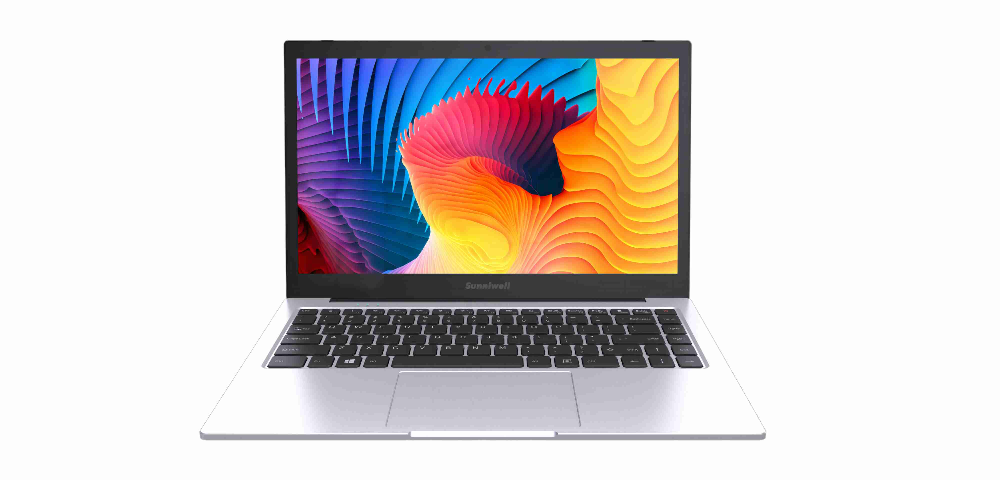
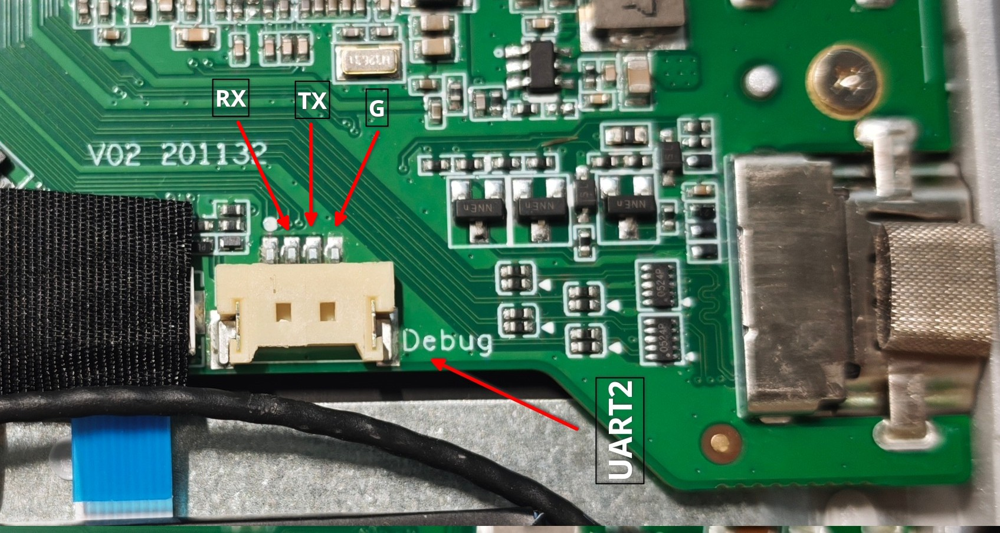
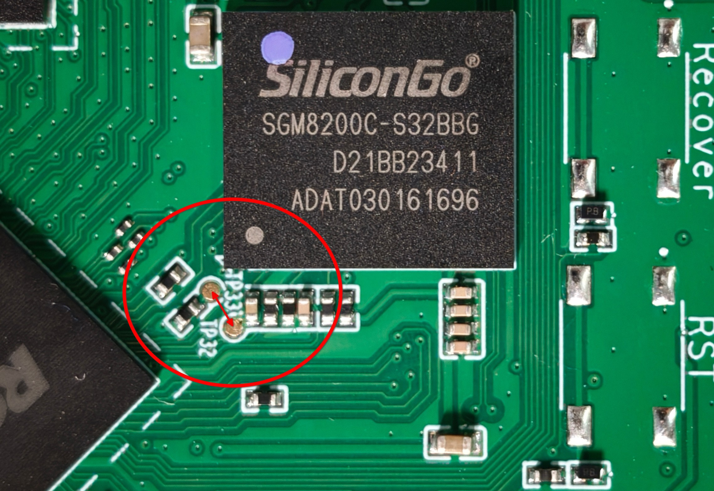

# Sunniwell Z96A

English · [简体中文](README.zh-CN.md)

The [Sunniwell](https://www.sunniwell.com/) Z96A is an RK3568‑based ARM cloud laptop pre‑loaded with Android 11 for cloud desktop VDI usage.

The Z96A ships in two hardware revisions that differ mainly in power input (with other minor differences):

- **Early revision (2022?)** — charges via a DC barrel jack.
- **Later revision (2023)** — charges via Type‑C PD; the firmware identifies this board as *Z97A* in some places, although the shell label still reads *Z96A*.

A further *Z96H* variant (also Type‑C PD charging) exists but never saw wide circulation on the second-hand market.

## Hardware

The hardware listed below currently only includes the PD (Type‑C charging) revision.

| Specifications          | Description                                                  |
| ----------------------- | ------------------------------------------------------------ |
| Model                   | Z96A                                                         |
| Main board PCB revision | V02 201132                                                   |
| USB board PCB revision  | V01 528032                                                   |
| SoC                     | Rockchip [RK3568B2](https://www.rock-chips.com/a/en/products/RK35_Series/2021/0113/1276.html) @2.0GHz / Quad-Core ARM Cortex-A55 / Mali-G52 2EE GPU |
| PMIC                    | Rockchip [RK809-5](https://rockchip.fr/RK809%20datasheet%20V2.7.pdf) / PMIC / Audio codec |
| DRAM                    | 4GB Rayson [RS1G32LO4D2BDS-53BT](https://szrayson.com/product_23/136.html) / LPDDR4X / x32 / 3733Mbps / FBGA 200-ball / 1.8/1.1/0.6V |
| eMMC                    | 32GB SiliconGo SGM8200C-S32BBG / HS400 / eMMC 5.1 / FBGA153 |
| WiFi/BT                 | Realtek [RTL8822CS](https://bbs.16rd.com/thread-602771-1-1.html) / 802.11 a/b/g/n/ac / BT4.2 / 2T2R |
| Display                 | BOE [NV140FHM‑N43](https://www.panelook.cn/NV140FHM-N43_BOE_14.0_LCM_overview_cn_27125.html) / 14 inch 16:9 IPS / 1920x1080 / 31 cm x 17 cm / 60HZ / eDP |
| Keyboard/Touchpad       | SinoWealth [SH61F83Q](https://www.sinowealth.com/detaile?pro_id=100) / AMR-TOUCH-MOUSE 202110 USB KEYBOARD / USB 1.1 / 6080:8060 |
| USB Hub                 | Genesys Logic [GL852G](https://www.genesyslogic.com.tw/en/product/show.php?num=GL852G&kind=USB2_Hub) / USB 2.0 / 4 MTT / QFN 28 / 05e3:0610 |
| Camera                  | Microdia Sonix Camera / USB 2.0 / UVC 1.00 / 0c45:6368 |
| PD Controller           | Hynetek [HUSB311BLA](https://www.hynetek.com/2422.html) / USB PD3.0 / 100W / QFN-14L |
| USB 3.1 Switch          | Unknown / D3EB 2342 F1                                       |
| Battery Charger         | SouthChip [SC8886SQDER](https://www.southchip.com/product/SC8886S) / 8A / QFN-32 |
| Battery                 | SHT [3585130-2S](https://www.newlaptopaccessory.com/cn/sht-3585130-2s-3585130-7.4v-37wh-batteries-p-11746.html) / 5000mAh / 37Wh / 8.4V (2S) |
| Hall Effect Switch      | Magnesensor [MH248](https://www.yasemi.com.cn/productinfo/2155346.html?templateId=1133605) |
| Audio ADC               | 3 * Everest [ES7202](http://www.everest-semi.com/pdf/ES7202%20PB.pdf) / Analog -> PDM / 2 channels |
| Audio Amplifier         | Awinic [AW8737AFCR](https://www.awinic.com/en/evbInfo/AW8737AFCR/289) / Class-K audio power amplifier / FCQFN-16L |
| Speaker                 | 2 * [BER-NM14G-R](https://rozetka.com.ua/ua/438553034/p438553034/) |
| DC-DC                   | Torch [TCS4525](https://www.tctek.cn/product/tcs4525/) / 6A / WCSP-20 |
| N MOSFET                | Vgsemi [VS3652DB](https://vgsemi.com/index/good_detail/?id=30&series_id=1) / Asymmetric Dual N-Channel / 30V / 24A |
| P MOSFET                | Ncepower [NCE30P20Q](https://item.szlcsc.com/datasheet/NCE30P20Q/515299.html) / Single P-Channel / 30V / 20A |
| Size                    | 329.6mm × 220mm × 14.9mm                                     |

| Interface | Description |
| --------- | ----------- |
| Power     | Type-C PD *1 |
| USB   | USB 2.0 Type A Host * 2 / USB 3.0 Type A Host * 1 / USB 3.1 Type C OTG * 1 |
| HDMI | HDMI 2.0 * 1 |
| Audio | 3.5mm Jack *1 |
| Mic | Analog Mic * 2 |
| Speaker | Speaker * 2                                                  |
| LED | Power LED / Caps Lock LED / Mic Mute LED |

## Images

See [images](./images) for device disassembly details.

## Debug UART

Z96A-PD:

- **UART** — UART2
- **Baud rate** — 1500000, 8N1
- **Interface** — MX1.25mm 4P connector

## Maskrom Mode

Z96A-PD:

Short arrow-marked test points and enter Maskrom mode on power‑up.

## Mainline Linux

RK3568 is one of the best-supported Rockchip SoCs in upstream Linux. 

Initial SoC support (Cortex-A55, GIC, timers, UART, SD/eMMC, USB3 DWC3, PCIe, GMAC, I2C/SPI/PWM and the RK809 PMIC) landed in Linux 5.16,

followed by the [VOP2](https://github.com/torvalds/linux/commit/604be85547ce4d61b89292d2f9a78c721b778c16) display controller (HDMI / MIPI-DSI) in 5.19. The Mali-G52 GPU is driven by the mainline [Panfrost](https://docs.mesa3d.org/drivers/panfrost.html) driver. 

### Device Tree

#### BSP kernel

Thanks to [bingo1991](https://github.com/bingo1991) and [kemp233](https://github.com/kemp233), device-tree adaptation for both revisions on the Rockchip **BSP** kernel is already complete:

- **Early revision (DC)** — [rk3568-z96a.dts](https://github.com/bingo1991/rk3568_laptop_sunniwell_z96a/blob/main/rk3568-z96a.dts)
- **Later revision (PD)** — [rk3568-z96a-laptop-v2.dts](https://github.com/kemp233/armbian-build-sunniwell-Z96a/blob/main/patch/kernel/rockchip-rk3568-z96a/legacy/dt/rk3568-z96a-laptop-v2.dts)

#### Mainline (upstream)

- **Later revision (PD)** — [rk3568-sunniwell-z96a-pd.dts](https://github.com/yjun123/linux/blob/add_sunniwell_z96a/arch/arm64/boot/dts/rockchip/rk3568-sunniwell-z96a-pd.dts)

As RK3568 eDP has no mainline driver, HDMI is the usable display output; the internal eDP panel is described in the file but left disabled until eDP support lands.

### Drivers

Mainline support status for the key peripherals. 
"Out-of-tree" items are covered by the Rockchip BSP vendor drivers carried in the [armbian/linux-rockchip](https://github.com/armbian/linux-rockchip) fork, not yet in upstream Linux.

| Component          | Chip                 | Mainline driver                         | Status                                                       |
| ------------------ | -------------------- | --------------------------------------- | ------------------------------------------------------------ |
| PMIC               | Rockchip RK809-5     | `rk808` (MFD/regulator)                 | Mainline                                                     |
| WiFi               | Realtek RTL8822CS    | `rtw88` (`CONFIG_RTW88_8822CS`)         | Mainline (SDIO, since v6.3)                                  |
| Bluetooth          | Realtek RTL8822CS    | `hci_uart` + `btrtl`                    | Mainline                                                     |
| Keyboard           | SinoWealth SH61F83Q  | `usbhid` (USB HID)                      | Mainline                                                     |
| Touchpad           | SinoWealth SH61F83Q  | `usbhid` (USB HID)                      | Mainline                                                     |
| Camera             | Microdia 0c45:6368   | `uvcvideo` (USB UVC)                    | Mainline                                                     |
| Display            | BOE NV140FHM-N43     | `rockchip-vop2` (DRM) + Analogix `analogix_dp` (eDP) + `panel-simple`  | VOP2 mainline (v5.19); eDP output unsupported — vendor kernel only                                  |
| Audio ADC          | Everest ES7202       | —                                       | Out-of-tree ([`snd_soc_es7202`](https://github.com/armbian/linux-rockchip/blob/rk-6.1-rkr7.2/sound/soc/codecs/es7202.c)) |
| Audio Amplifier    | Awinic AW8737AFCR    | `simple-amplifier` (GPIO `enable-gpios`) | Mainline                                                     |
| USB Hub            | Genesys Logic GL852G | `usbcore` (generic hub)                 | Mainline                                                     |
| Hall Effect Switch | Magnesensor MH248    | — (GPIO interrupt, no dedicated driver) | Not needed (GPIO)                                            |
| PD Controller      | Hynetek HUSB311      | `tcpci_rt1711h`                         | Mainline (since v7.1)                                        |
| Battery Charger    | SouthChip SC8886     | —                                       | Out-of-tree ([`bq25700_charger`](https://github.com/armbian/linux-rockchip/blob/rk-6.1-rkr7.2/drivers/power/supply/bq25700_charger.c)) |
| DC-DC              | Torch TCS4525        | `fan53555` (regulator)                  | Mainline (since v5.13)                                       |

### Firmware

## Reference

[华为云商店 - Z96A云笔电](https://marketplace.huaweicloud.com/contents/bfc3050c-2596-4c18-91ea-d2482201a308)

[Github - bingo1991/rk3568_laptop_sunniwell_z96a](https://github.com/bingo1991/rk3568_laptop_sunniwell_z96a)

[Github - kemp233/armbian-build-sunniwell-Z96a](https://github.com/kemp233/armbian-build-sunniwell-Z96a)

[Github - dontshootitsme/armbian-build-sunniwell-Z96a](https://github.com/dontshootitsme/armbian-build-sunniwell-Z96a)

[Github - momokind/armbian-build](https://github.com/momokind/armbian-build)

[Github - armbian/build - Evaneee@Add new board in future- #6274](https://github.com/armbian/build/pull/6274)

[Github - ophub/amlogic-s9xxx-armbian - bingo1991@申请增加朝歌Z96A这款电信天翼云电脑笔记本终端(RK3568,4+32)的适配 #1967](https://github.com/ophub/amlogic-s9xxx-armbian/issues/1967)

[Github - armbian/linux-rockchip - bingo1991@Add support for Sunniwell Z96A RK3568 Laptop- #213](https://github.com/armbian/linux-rockchip/pull/213)

[Github - gjrtimmer/ubuntu-rockchip - gjrtimmer@[BC-14] Add Sunniwell Z96A laptop (RK3568) board support #58](https://github.com/gjrtimmer/ubuntu-rockchip/issues/58)

[Bilibili - 一路人甲一 - 朝歌z96a移植GarlicOS系统体验](https://www.bilibili.com/video/BV1e38TeCEKp)
