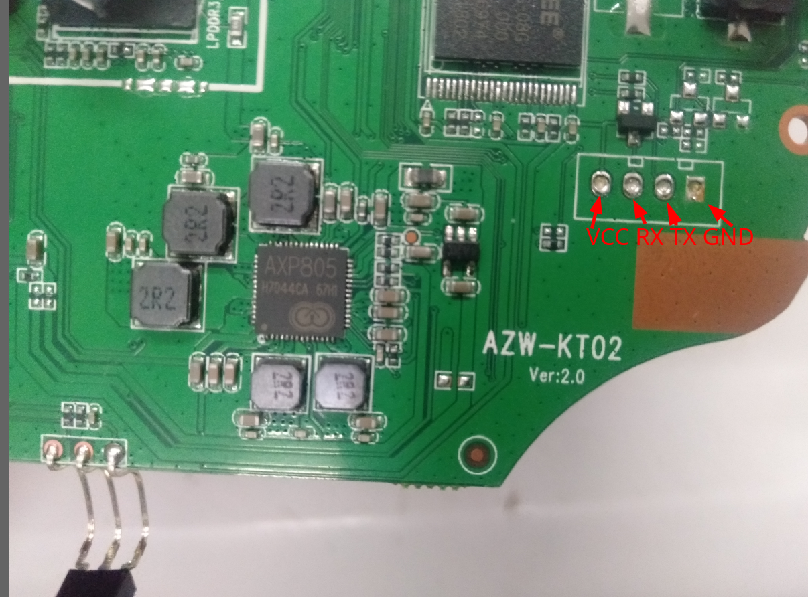

# 泰奇猫 TQC-A01 

[TQC official website](https://tq.ultrapower.com.cn/index.html)

## Hardware

| Specifications| Description |
| ----- | --- |
| PCB   | AZW-KT02 2.0 |
| Soc   | Allwinner [H6](https://linux-sunxi.org/H6)@1.8Ghz/V2000-AWIN/BGA451/15X15mm/Quad-core Cotex-A53 |
| DRAM  | 1GiB LPDDR3 [SS256M32V01MD1LPF-107BT](https://www.spectek.com/menus/we_detail.aspx?memType=LPDDR3)/PB047-125 PT/BGA178/1600Mbps |
| Power | DC 5V@2A |
| eMMC  | Longsys Foresee eMMC [NCEMAM6G-08G](https://www.arrow.com/en/datasheets/9029653725/shenzhen-longsys-electronics-co.-ltd/ncemam6g-08g)/BGA153/eMMC 5.1 |
| Wireless Module | AMPAK [AP6212](https://fccid.io/PJ5-AX905/User-Manual/User-manual-3321089.pdf)/802.11b/g/n BT 4.0/B11210011 1753/1T1R |
| PMU/PMIC | [AXP805](http://linux-sunxi.org/images/b/bc/AXP805_Datasheet_V1.0_en.pdf)/H7044CA 67H1/3V to 5.5V/QFN56_7X7/XPOWER |
| Lan Transformer | [AE-SB16001](http://www.appselectronics.com/Uploads/product/5ae167b80285a.pdf) |
| Size  | 96 * 96 * 17mm|

| Interface | Description  |
| ------------ | --- |
| USB 2.0 Host | * 1 |
| USB 3.0 Host | * 1 |
| USB 2.0 OTG  | * 1 |
| HDMI         | * 1 |
| Ethernet     | integrated 10/100M PHY / RJ45 * 1 |
| WiFi         | integraed in AP6212 BCM43430 |
| SPDIF        | * 1 |
| MicroSD      | * 1 |
| Infrared     | * 1 |
| Bluetooth    | integraed in AP6212 *1 BCM43430A1 |

## Allwinner H6

[linux-sunxi H6](https://linux-sunxi.org/H6)

## AP6212

[AMPAK AP6212](https://deviwiki.com/wiki/AMPAK_AP6212)

| Function | Interface in use |
| -------- | --------- |
| WiFi     |  SDIO     |
| BT       |  UART     |

## TTL UART

## Mainline Linux

## Mainline U-Boot

